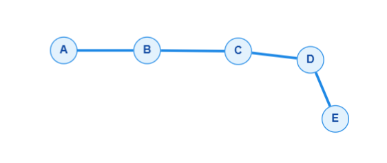

# Marco 2 — Componentes conexas

## 1. Caso particular adaptado

Para estudar conectividade, as relações do problema **Fox And Names** foram adaptadas para um grafo simples e não dirigido. A direção original das relações não é considerada, não há laços e não há arestas múltiplas.

A entrada utilizada possui as letras `A`, `B`, `C`, `D` e `E`, indexadas de `0` a `4`:

### Entrada

```text
5
a
b
c
cd
ce
```

| Índice | Vértice |
| ---: | :---: |
| 0 | A |
| 1 | B |
| 2 | C |
| 3 | D |
| 4 | E |

As arestas observadas na imagem são:

```text
E = {(A,B), (B,C), (C,D), (D,E)}
```

Logo, `|V| = 5` e `|E| = 4`, ambos dentro do limite `V <= 6` e `E <= 6`. O grafo é o caminho simples `P_5` e possui uma única componente conexa:

```text
omega(G) = 1
cc(A) = cc(B) = cc(C) = cc(D) = cc(E) = 0
```

A adaptação transforma as relações em arestas não dirigidas porque, neste marco, o objetivo é estudar alcançabilidade e componentes conexas, e não produzir uma ordenação topológica.

## 2. Desenho do grafo e listas de adjacência

### Imagem do grafo



### Listas de adjacência

Como o grafo é não dirigido, cada aresta aparece nas listas dos dois extremos:

```text
G.adj(A) = [B]
G.adj(B) = [A, C]
G.adj(C) = [B, D]
G.adj(D) = [C, E]
G.adj(E) = [D]
```

A soma dos graus é `1 + 2 + 2 + 2 + 1 = 8 = 2|E|`, como esperado.

## 3. Excentricidades, raio, diâmetro e centro

Como o grafo possui uma única componente, todas as distâncias entre seus vértices são finitas.

| Vértice | Distâncias aos demais vértices | Excentricidade |
| --- | --- | ---: |
| A | `d(A,B)=1`, `d(A,C)=2`, `d(A,D)=3`, `d(A,E)=4` | `exc(A)=4` |
| B | `d(B,A)=1`, `d(B,C)=1`, `d(B,D)=2`, `d(B,E)=3` | `exc(B)=3` |
| C | `d(C,A)=2`, `d(C,B)=1`, `d(C,D)=1`, `d(C,E)=2` | `exc(C)=2` |
| D | `d(D,A)=3`, `d(D,B)=2`, `d(D,C)=1`, `d(D,E)=1` | `exc(D)=3` |
| E | `d(E,A)=4`, `d(E,B)=3`, `d(E,C)=2`, `d(E,D)=1` | `exc(E)=4` |

Portanto:

```text
raio(G) = min{4, 3, 2, 3, 4} = 2
diâmetro(G) = max{4, 3, 2, 3, 4} = 4
```

O único vértice central é `C`, pois `exc(C) = raio(G) = 2`. Assim:

```text
centro(G) = {C}
```

## 4. Rastreamento manual da DFS

O algoritmo de componentes conexas utiliza as seguintes estruturas:

```text
boolean[] marked = [false, false, false, false, false]
int[] id = [?, ?, ?, ?, ?]
int count = 0
```

A lógica é:

```text
para v de 0 até V - 1:
    se marked[v] == false:
        dfs(G, v)
        count++
```

A busca recursiva é:

```text
dfs(G, v):
    marked[v] = true
    id[v] = count
    para cada w em G.adj(v):
        se marked[w] == false:
            dfs(G, w)
```

### Estado inicial

```text
marked = [F, F, F, F, F]
id     = [?, ?, ?, ?, ?]
count  = 0
```

### `v = 0` — chamada `dfs(A)`

A busca percorre o caminho até `E`:

```text
dfs(A), count = 0
  marca A; id[A] = 0
  visita B
    marca B; id[B] = 0
    visita A -> já marcado
    visita C
      marca C; id[C] = 0
      visita B -> já marcado
      visita D
        marca D; id[D] = 0
        visita C -> já marcado
        visita E
          marca E; id[E] = 0
          visita D -> já marcado
retorna de dfs(E)
retorna de dfs(D)
retorna de dfs(C)
retorna de dfs(B)
retorna de dfs(A)
```

Após o retorno de `dfs(A)`, todos os vértices estão marcados:

```text
marked = [T, T, T, T, T]
id     = [0,  0,  0,  0,  0]
count  = 1
```

### `v = 1, 2, 3, 4`

Todos os vértices já possuem `marked[v] == true`. Portanto, nenhuma nova DFS é iniciada e o contador permanece `count = 1`.

O resultado confirma que o grafo possui uma única componente conexa.

## 5. Consultas de conectividade

Após a DFS, uma consulta é respondida comparando os identificadores:

```text
connected(v, w):
    retornar id[v] == id[w]
```

| Consulta | Avaliação | Resultado |
| --- | --- | --- |
| `connected(A, E)` | `id[A] == id[E]`, isto é, `0 == 0` | `true` |
| `connected(B, D)` | `0 == 0` | `true` |
| `connected(C, C)` | `0 == 0` | `true` |
| `connected(A, C)` | `0 == 0` | `true` |
| `connected(D, E)` | `0 == 0` | `true` |

## 6. Complexidade

O laço externo percorre todos os `V` vértices. A DFS visita cada vértice uma vez e examina cada entrada das listas de adjacência. Como cada aresta não dirigida aparece duas vezes, o tempo total é:

```text
Theta(V + 2E) = Theta(V + E)
```

O vetor `marked`, o vetor `id` e a pilha de recursão ocupam `Theta(V)` espaço auxiliar. As listas de adjacência ocupam `Theta(V + E)` espaço para representar o grafo. Portanto, o espaço total, incluindo o grafo, é `Theta(V + E)`.

Cada consulta `connected(v, w)` compara apenas `id[v]` e `id[w]`, portanto custa `Theta(1)` após a pré-computação. Para `Q` consultas, o custo adicional é `Theta(Q)` e o custo total é `Theta(V + E + Q)`.

## 7. Cobertura de testes

Além da instância principal representada na imagem, os testes abaixo ampliam a validação do algoritmo:

| ID | Grafo ou consulta | Resultado esperado | Conceito coberto |
| --- | --- | --- | --- |
| T1 | Caminho `A-B-C-D-E` da entrada | `count=1`; `id=[0,0,0,0,0]`; raio `2`; diâmetro `4`; centro `{C}` | Caso principal completo |
| T2 | Cinco vértices sem arestas | `count=5`; cada vértice recebe um identificador diferente | Vértices isolados |
| T3 | Triângulo `A-B-C-A` | `count=1`; todas as excentricidades são `1` | Ciclo e múltiplos caminhos |
| T4 | Duas componentes: `A-B-C` e `D-E` | `count=2`; `connected(A,C)=true`; `connected(A,D)=false` | Componentes de tamanhos diferentes |
| T5 | Grafo com seis vértices e seis arestas, dividido em três componentes | `count=3` | Limites `V <= 6` e `E <= 6` sem assumir conectividade |
| T6 | Arestas repetidas `A-B`, `B-A`, `A-B` | Uma única aresta armazenada | Grafo simples sem arestas múltiplas |
| T7 | Laço `(A,A)` | O laço é rejeitado e não aparece na adjacência | Grafo simples sem laços |
| T8 | `connected(A,E)`, `connected(C,C)` e `connected(B,D)` no caso principal | `true`, `true`, `true` | Consultas entre vértices da mesma componente |
| T9 | DFS iniciada em cada vértice após a primeira busca | Nenhuma visita duplicada; `count` não aumenta | Marcação e controle do laço principal |
| T10 | Caminho com ordem de adjacência invertida | Mesmas componentes e mesmas métricas | Independência em relação à ordem das listas |

### Critério de aprovação

Um teste é aprovado quando:

- todos os vértices recebem exatamente um identificador de componente;
- `count` coincide com o número esperado de componentes;
- as consultas `connected` retornam os valores esperados;
- nenhuma aresta duplicada ou laço é mantido na representação simples;
- o raio, o diâmetro e o centro de cada componente coincidem com os cálculos manuais.
