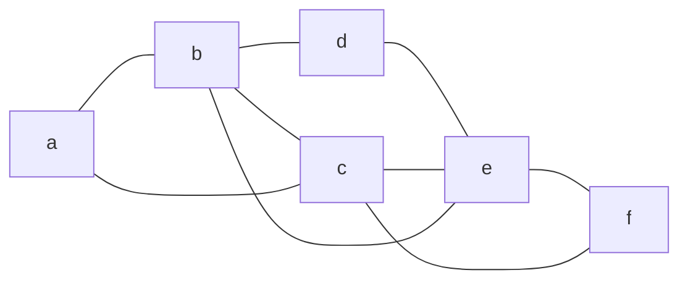

# Marco 3

**Problema:** *Fox And Names* (Codeforces 510C).

**Escopo deste marco:** o grafo real do problema é **direcionado** e tem sempre **26 vértices** (as letras). Neste marco, seguindo a aula A5 (Grafos Eulerianos), deixamos esse grafo de lado e usamos uma **instância representativa não dirigida**, com vértices nomeados por letras, para rastrear manualmente o **algoritmo de Hierholzer** como foi apresentado em aula.

---

## 1. Propriedade estrutural central

**Circuito de Euler:** um passeio fechado que usa **todas as arestas exatamente uma vez**.

**Critério de reconhecimento (Teorema 2 da aula):** um grafo conexo tem circuito de Euler **se e somente se todo vértice tem grau par**.

- Se exatamente dois vértices têm grau ímpar, existe apenas **trilha** de Euler (Teorema 3), começando em um ímpar e terminando no outro.
- Se o grafo for desconexo (desconsiderando vértices isolados), não há circuito.

**Por que o grau par garante o funcionamento do Hierholzer:** cada vez que o passeio entra em um vértice por uma aresta, ele consome duas arestas desse vértice (entrada e saída). Com todos os graus pares, o único vértice onde o passeio pode "travar" (ficar sem aresta livre) é o vértice onde ele começou. Por isso cada passeio construído é sempre um **ciclo fechado**.

**Relação com o problema real:** no *Fox And Names*, a propriedade exigida é outra — o grafo de precedência precisa ser um **DAG**, e a resposta é uma **ordenação topológica**; a existência de ciclo leva a `Impossible` (ver Marco 1).

---

## 2. Implementações de referência (`algs4`)

Sem implementar código nesta etapa.

| Classe `algs4` | Papel | Adaptação prevista |
|---|---|---|
| `Graph` | Grafo não dirigido por listas de adjacência | Nenhuma; usado na instância deste marco |
| `EulerianCycle` | Hierholzer para grafo não dirigido (versão iterativa com pilha) | Nenhuma; serve de referência para o rastreamento |
| `Digraph` | Grafo direcionado das 26 letras (problema real) | Evitar arestas repetidas entre o mesmo par de letras |
| `DirectedCycle` | Detecta ciclo no dígrafo → `Impossible` | Nenhuma |
| `Topological` (`topological.py` no Python) | Ordem topológica → permutação do alfabeto | Converter índices `0..25` de volta para letras |

**Observação sobre `EulerianCycle`:** a implementação do `algs4` usa uma pilha e marca cada aresta como usada (`isUsed`). A ideia é a mesma do pseudocódigo da aula: quando o passeio trava, ele volta pela pilha até um vértice que ainda tem aresta livre e começa um subciclo ali. A diferença é que a "inserção" do subciclo `H` em `C` acontece implicitamente pela ordem em que os vértices saem da pilha.

---

## 3. Instância representativa

**V = 6, E = 9**, grafo simples, não dirigido e conexo.



Arestas: `a-b`, `b-c`, `c-a`, `b-d`, `d-e`, `e-b`, `c-e`, `e-f`, `f-c`.

> **Entrada que gera a instância:**
>
> ```
> 10
> a
> b
> d
> e
> c
> f
> ea
> ba
> ca
> aa
> ```
>
> Comparando nomes consecutivos, obtêm-se as arestas dirigidas `a→b, b→d, d→e, e→c, c→f, f→e, e→b, b→c, c→a`.
> Ignorando o sentido, chega-se ao grafo acima.
> No problema real a saída seria `Impossible`, pois há ciclo (ex.: `a→b→c→a`) — a instância serve apenas para exercitar o Hierholzer.

### 3.1 Listas de adjacência (em ordem alfabética)

| Vértice | Adjacentes | Grau |
|---|---|---|
| a | b, c | 2 |
| b | a, c, d, e | 4 |
| c | a, b, e, f | 4 |
| d | b, e | 2 |
| e | b, c, d, f | 4 |
| f | c, e | 2 |

Soma dos graus = 18 = 2 · 9 ✔

### 3.2 Verificação do critério

- Conexo: sim (todos alcançáveis a partir de `a`).
- Todos os graus são pares.

Pelo Teorema 2, o grafo **é euleriano** → podemos aplicar Hierholzer.

### 3.3 Regra de escolha

O pseudocódigo da aula escolhe as arestas "aleatoriamente". Para o rastreamento ser reproduzível, fixamos: **sempre seguir a aresta livre para o vizinho de menor letra**, e, para escolher o vértice de início de um novo subciclo, **percorrer `C` da esquerda para a direita** e pegar o primeiro vértice com grau > 0 no grafo reduzido `K`.

---

## 4. Rastreamento manual do Hierholzer

Estruturas mantidas:
- `C`: ciclo principal (sequência de vértices).
- `H`: subciclo da iteração atual.
- `K`: grafo reduzido (arestas ainda não percorridas) e o grau `d(v)` de cada vértice em `K`.

### Passos 1–2: ciclo inicial a partir de `v = a`

| Passo | Vértice atual | Arestas livres | Escolha | Aresta removida | Passeio |
|---|---|---|---|---|---|
| 1 | a | b, c | b | a-b | a, b |
| 2 | b | c, d, e | c | b-c | a, b, c |
| 3 | c | a, e, f | a | c-a | a, b, c, a |
| 4 | a | — | trava no início | — | fechado |

`C = (a, b, c, a)` — 3 arestas.

### Passos 3–4: grafo reduzido `K`

Arestas restantes `A1`: `b-d`, `d-e`, `e-b`, `c-e`, `e-f`, `f-c` (6 arestas).

| v | a | b | c | d | e | f |
|---|---|---|---|---|---|---|
| d(v) em K | 0 | 2 | 2 | 2 | 4 | 2 |

`A1 ≠ ∅` → entra no laço.

### Iteração 1

**Escolha do vértice (passo 6):** percorrendo `C = (a, b, c, a)`: `a` tem grau 0; `b` tem grau 2 → **v = b**.

**Construção de H (passo 7):**

| Vértice atual | Arestas livres | Escolha | Aresta removida | Passeio |
|---|---|---|---|---|
| b | d, e | d | b-d | b, d |
| d | e | e | d-e | b, d, e |
| e | b, c, f | b | e-b | b, d, e, b |
| b | — | trava no início | — | fechado |

`H = (b, d, e, b)`

**União (passo 9):** substitui-se a primeira ocorrência de `b` em `C` por `H`:

```
C = (a, [b], c, a)  +  H = (b, d, e, b)
C = (a, b, d, e, b, c, a)
```

**K atualizado:** arestas restantes `c-e`, `e-f`, `f-c`.

| v | a | b | c | d | e | f |
|---|---|---|---|---|---|---|
| d(v) em K | 0 | 0 | 2 | 0 | 2 | 2 |

`A1 ≠ ∅` → continua.

### Iteração 2

**Escolha do vértice:** percorrendo `C = (a, b, d, e, b, c, a)`: `a` 0, `b` 0, `d` 0, `e` 2 → **v = e**.

**Construção de H:**

| Vértice atual | Arestas livres | Escolha | Aresta removida | Passeio |
|---|---|---|---|---|
| e | c, f | c | e-c | e, c |
| c | f | f | c-f | e, c, f |
| f | e | e | f-e | e, c, f, e |
| e | — | trava no início | — | fechado |

`H = (e, c, f, e)`

**União:** substitui-se a primeira ocorrência de `e` em `C` por `H`:

```
C = (a, b, d, [e], b, c, a)  +  H = (e, c, f, e)
C = (a, b, d, e, c, f, e, b, c, a)
```

**K atualizado:** nenhuma aresta restante → `A1 = ∅` → **fim do laço**.

### Resultado

**Circuito de Euler:** `a → b → d → e → c → f → e → b → c → a`

**Verificação:** 10 vértices na sequência = 9 arestas, e cada aresta aparece uma única vez:

| # | Aresta |
|---|---|
| 1 | a-b |
| 2 | b-d |
| 3 | d-e |
| 4 | e-c |
| 5 | c-f |
| 6 | f-e |
| 7 | e-b |
| 8 | b-c |
| 9 | c-a |

Todas as 9 arestas do grafo foram usadas exatamente uma vez, e o passeio começa e termina em `a` ✔

**Decisões do algoritmo, resumidas:**
- Os vértices de grau 4 (`b`, `c`, `e`) são exatamente os que aparecem duas vezes no circuito final — cada visita consome 2 arestas.
- `e` só foi escolhido como início da iteração 2 porque já pertencia a `C`; um subciclo sempre começa em um vértice de `C`, o que garante que a união continue sendo um único passeio fechado.

---

## 5. Complexidade

Sejam `V` vértices e `E` arestas.

**Tempo:**
- Verificar o critério (graus pares + conexidade por DFS): `O(V + E)`.
- Hierholzer: cada aresta é percorrida e removida uma única vez. Com listas encadeadas (como indicado na aula) ou com a marcação `isUsed` do `algs4`, a remoção e a consulta de adjacência custam `O(1)` amortizado, e a união de `H` em `C` é feita por ajuste de ponteiros em `O(1)`.
- **Total: `O(V + E)`**.

**Memória:**
- **Representação do grafo:** listas de adjacência, `O(V + E)` (em grafo não dirigido, cada aresta aparece em duas listas).
- **Memória auxiliar:** marcação de arestas usadas `O(E)`, ciclo `C` com `E + 1` vértices `O(E)`, pilha/subciclo `H` `O(E)` no pior caso, graus em `K` `O(V)`. Total auxiliar: `O(V + E)`.

**Na instância:** 9 arestas → 9 remoções; o ciclo final tem 10 posições.

**Problema real (para comparação):** o dígrafo tem `V = 26` fixo e no máximo 99 arestas (uma por par de nomes consecutivos). A coleta das arestas custa `O(n · L)` (`n ≤ 100`, `L ≤ 100`) e a ordenação topológica `O(V + E)`, ou seja, praticamente constante.

---

## 6. Execução da DFS usada pela ordenação topológica

Embora a instância principal deste marco seja dedicada ao algoritmo de Hierholzer, o
problema real *Fox And Names* usa as classes `DirectedCycle`, `DepthFirstOrder` e
`Topological`. A tabela abaixo mostra, em uma instância pequena, como a DFS usada
para obter a ordenação topológica é executada.

### 6.1 Instância e estruturas

Considere as restrições:

```text
b -> a
d -> a
a -> c
```

Representando as letras por índices (`a = 0`, `b = 1`, `c = 2`, `d = 3`), as
listas de adjacência são:

```text
adj[a] = [c]
adj[b] = [a]
adj[c] = []
adj[d] = [a]
```

O laço da DFS percorre os vértices na ordem `a, b, c, d`.

| Estrutura | Função |
|---|---|
| `visited` (`marked`) | Indica se o vértice já foi visitado |
| `onStack` | Indica se o vértice ainda está no caminho atual da DFS |
| `postStack` | Guarda os vértices na ordem em que terminam |
| `edgeTo[w]` | Guarda o vértice que levou a DFS até `w` |
| `pre` | Registra a ordem em que o vértice foi descoberto |
| `reversePost` | Inversão da pós-ordem; será a ordem topológica |

`edgeTo` é usado principalmente por `DirectedCycle` para reconstruir um ciclo,
caso seja encontrado. A `DepthFirstOrder` registra `pre`, `post` e
`reversePost`; ela não precisa de `edgeTo` para construir a ordenação.

Estado inicial:

```text
visited  = [F, F, F, F]
onStack  = [F, F, F, F]
postStack = []
edgeTo   = [--, --, --, --]
```

### 6.2 Tabela de execução

| Passo | Ação | Vértice atual | `visited` | `onStack` | `postStack` | `edgeTo` | Explicação |
|---:|---|---|---|---|---|---|---|
| 1 | Inicia `dfs(a)` | `a` | `[V,F,F,F]` | `[V,F,F,F]` | `[]` | `[--,--,--,--]` | `a` é descoberto e entra no caminho atual |
| 2 | Examina `a -> c` | `a` | `[V,F,F,F]` | `[V,F,F,F]` | `[]` | `[--,--,--,--]` | `c` ainda não foi visitado |
| 3 | Define predecessor de `c` | `a` | `[V,F,F,F]` | `[V,F,F,F]` | `[]` | `[--,--,a,--]` | `edgeTo[c] = a` |
| 4 | Inicia `dfs(c)` | `c` | `[V,F,V,F]` | `[V,F,V,F]` | `[]` | `[--,--,a,--]` | `c` é descoberto |
| 5 | Verifica adjacentes de `c` | `c` | `[V,F,V,F]` | `[V,F,V,F]` | `[]` | `[--,--,a,--]` | `c` não possui sucessores |
| 6 | Finaliza `c` | `c` | `[V,F,V,F]` | `[V,F,F,F]` | `[c]` | `[--,--,a,--]` | `c` sai do caminho e entra na pós-ordem |
| 7 | Retorna para `a` | `a` | `[V,F,V,F]` | `[V,F,F,F]` | `[c]` | `[--,--,a,--]` | A DFS de `c` terminou |
| 8 | Finaliza `a` | `a` | `[V,F,V,F]` | `[F,F,F,F]` | `[c,a]` | `[--,--,a,--]` | `a` é colocado após seu sucessor |
| 9 | Inicia `dfs(b)` | `b` | `[V,V,V,F]` | `[F,V,F,F]` | `[c,a]` | `[--,--,a,--]` | `b` ainda não havia sido visitado |
| 10 | Examina `b -> a` | `b` | `[V,V,V,F]` | `[F,V,F,F]` | `[c,a]` | `[--,--,a,--]` | `a` já foi visitado |
| 11 | Não revisita `a` | `b` | `[V,V,V,F]` | `[F,V,F,F]` | `[c,a]` | `[--,--,a,--]` | `a` não está em `onStack`; não há ciclo |
| 12 | Finaliza `b` | `b` | `[V,V,V,F]` | `[F,F,F,F]` | `[c,a,b]` | `[--,--,a,--]` | `b` entra na pós-ordem |
| 13 | Inicia `dfs(d)` | `d` | `[V,V,V,V]` | `[F,F,F,V]` | `[c,a,b]` | `[--,--,a,--]` | `d` ainda não havia sido visitado |
| 14 | Examina `d -> a` | `d` | `[V,V,V,V]` | `[F,F,F,V]` | `[c,a,b]` | `[--,--,a,--]` | `a` já foi visitado |
| 15 | Não revisita `a` | `d` | `[V,V,V,V]` | `[F,F,F,V]` | `[c,a,b]` | `[--,--,a,--]` | `a` não está no caminho atual |
| 16 | Finaliza `d` | `d` | `[V,V,V,V]` | `[F,F,F,F]` | `[c,a,b,d]` | `[--,--,a,--]` | `d` entra na pós-ordem |

`F` significa falso e `V` significa verdadeiro. A pós-ordem é a ordem em que os
vértices terminam:

```text
post-order = [c, a, b, d]
```

`DepthFirstOrder.reversePost()` inverte essa sequência:

```text
reversePost = [d, b, a, c]
```

Essa é uma ordenação topológica válida, pois:

```text
b aparece antes de a
d aparece antes de a
a aparece antes de c
```

### 6.3 Fluxo entre as classes

O construtor de `Topological` executa as classes na seguinte ordem:

```text
Topological(graph)
    |
    +-- cria DirectedCycle(graph)
    |       |
    |       +-- verifica se existe ciclo
    |
    +-- se não houver ciclo:
            |
            +-- cria DepthFirstOrder(graph)
            |       |
            |       +-- executa a DFS
            |       +-- registra a pós-ordem
            |
            +-- chama reversePost()
                    |
                    +-- obtém a ordem topológica
```

Assim, `DirectedCycle` executa uma DFS para detectar ciclos. Somente se o grafo
for acíclico `Topological` cria `DepthFirstOrder`, que executa outra DFS para
calcular a pós-ordem reversa. Depois, `Topological` armazena essa sequência em
`order` e constrói `rank`, que informa a posição de cada vértice na ordem.

Se `DirectedCycle` encontrar um ciclo, `order` permanece `null`, `hasOrder()`
retorna `false` e o programa pode imprimir `Impossible`.
