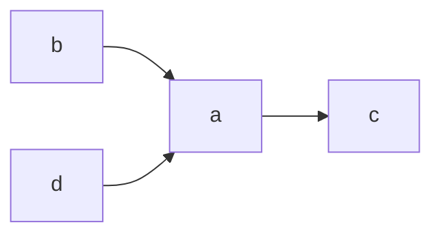

# Marco 3

**Problema:** *Fox And Names* (Codeforces 510C).

Neste marco, a solução é detalhada no nível das estruturas de dados e das decisões do algoritmo. O código ainda não será implementado.

## 1. Propriedade estrutural central

A propriedade central é que o grafo de precedência das letras precisa ser um **DAG** (grafo direcionado acíclico).

### Como o grafo é construído

Cada letra minúscula `a` até `z` é um vértice. Para cada par de nomes consecutivos `s` e `t`, comparamos os caracteres até a primeira posição `i` em que `s[i] != t[i]`:

- se `s[i] = x` e `t[i] = y`, criamos a aresta direcionada `x -> y`;
- depois da primeira diferença, os demais caracteres não produzem novas restrições;
- se um nome é prefixo do seguinte, nenhuma aresta é criada;
- se o nome maior aparece antes do próprio prefixo, a instância é impossível.

Uma aresta `x -> y` significa que `x` deve aparecer antes de `y` no novo alfabeto. Arestas repetidas podem ser ignoradas, pois representam a mesma restrição.

### Critério de reconhecimento e obtenção da resposta

O critério é a existência de ciclo direcionado:

- se houver um ciclo, as restrições são contraditórias e a resposta é `Impossible`;
- se não houver ciclo, o grafo é um DAG e uma ordenação topológica fornece uma permutação válida das 26 letras.

O ciclo é reconhecido por DFS usando três estados por vértice: não visitado, em processamento e concluído. Encontrar uma aresta para um vértice em processamento indica um ciclo. Quando um vértice termina, ele é colocado em uma pilha de pós-ordem; retirar essa pilha produz a ordenação topológica.

Assim, a propriedade não é apenas que as comparações locais sejam possíveis: todas as relações precisam ser compatíveis globalmente. O caso de prefixo é verificado antes da construção final do grafo porque pode tornar a ordenação impossível sem gerar uma aresta.

## 2. Implementações de referência (`algs4-py`)

As classes serão consultadas no diretório `algs4-py/algs4` do repositório indicado. Nesta etapa, elas serão usadas como referência ou adaptadas, sem implementar o código da solução.

| Classe | Papel na solução | Adaptação prevista |
|---|---|---|
| `Digraph` | Representar as 26 letras e as arestas de precedência por listas de adjacência | Criar o grafo com `V = 26`; converter letras para índices `0..25`; evitar ou ignorar arestas repetidas |
| `DirectedCycle` | Detectar ciclo direcionado durante a DFS | Usar `hasCycle()` para decidir entre `Impossible` e a continuação da solução |
| `DepthFirstOrder` | Registrar a ordem de término da DFS | Usar a pós-ordem reversa como ordem topológica quando o grafo não tiver ciclo |
| `Topological` | Encapsular o teste de ciclo e a produção da ordem topológica | Consultar `hasOrder()` e `order()`; adaptar a conversão dos índices para letras e a saída das 26 posições |
| `Stack` | Armazenar a pós-ordem reversa ou acompanhar a ordem durante o rastreamento | Usar a estrutura para explicitar o estado da ordem topológica; não alterar o critério do algoritmo |

Além dessas classes, será necessário manter estruturas específicas da entrada: os nomes consecutivos, o vetor de estados da DFS e a rotina que trata o caso de prefixo. A classe `Topological` não substitui essa etapa de modelagem, pois recebe o dígrafo já construído.

## 3. Instância pequena e construção do grafo

### Entrada

```text
4
baa
abcd
abca
cab
```

### Comparações e restrições

1. `baa` e `abcd`: primeira diferença `b` contra `a`, então `b -> a`.
2. `abcd` e `abca`: primeira diferença `d` contra `a`, então `d -> a`.
3. `abca` e `cab`: primeira diferença `a` contra `c`, então `a -> c`.

Não há caso de prefixo nessa entrada. O subgrafo não isolado é:



O `Digraph` possui os 26 vértices `a` até `z`, mas apenas três arestas. As listas relevantes, antes da DFS, são:

```text
adj(a) = [c]
adj(b) = [a]
adj(c) = []
adj(d) = [a]
adj(e), ..., adj(z) = []
```

Os graus de entrada relevantes são `indegree(a)=2`, `indegree(c)=1`, `indegree(b)=0` e `indegree(d)=0`. Esses graus ajudam a conferir o resultado, embora o rastreamento abaixo use a implementação baseada em DFS de `Topological`.

## 4. Rastreamento manual da estratégia

As estruturas de controle da DFS são:

```text
marked[26] = false
onStack[26] = false
reversePost = []
cycle = false
```

Para tornar o rastreamento determinístico, os vértices são examinados na ordem `a, b, c, d, ..., z`, e as listas de adjacência são percorridas em ordem alfabética.

### DFS em `a`

Estado inicial:

```text
marked = {a:false, b:false, c:false, d:false, ...}
onStack = {a:false, b:false, c:false, d:false, ...}
reversePost = []
cycle = false
```

1. Começa `dfs(a)`: marca `a` e coloca `a` em `onStack`.
2. A única aresta é `a -> c`. Como `c` ainda não foi visitado, começa `dfs(c)`.
3. `c` não possui arestas. `c` sai de `onStack` e é inserido em `reversePost`.
4. `a` termina, sai de `onStack` e é inserido em `reversePost`.

Estado após `dfs(a)`:

```text
marked[a..c] = {a:true, b:false, c:true}
onStack[a..c] = {a:false, b:false, c:false}
reversePost = [c, a]
cycle = false
```

### DFS em `b`

5. O laço externo chega a `b`: marca `b` e examina `b -> a`.
6. `a` já está marcado, mas não está em `onStack`; portanto, essa aresta não forma ciclo.
7. `b` termina e é acrescentado à pós-ordem.

Estado:

```text
marked[a..c] = {a:true, b:true, c:true}
onStack[a..c] = {a:false, b:false, c:false}
reversePost = [c, a, b]
cycle = false
```

### DFS em `d`

8. O laço externo chega a `d`: marca `d` e examina `d -> a`.
9. `a` está concluído, então a aresta é aceita e não há retorno para um vértice em processamento.
10. `d` termina e é acrescentado à pós-ordem.

Estado:

```text
marked[a..d] = {a:true, b:true, c:true, d:true}
onStack[a..d] = {a:false, b:false, c:false, d:false}
reversePost = [c, a, b, d]
cycle = false
```

Os vértices `e` até `z` são isolados: cada um é marcado, entra e sai de `onStack` sem examinar arestas, e é acrescentado à pós-ordem. Como nenhum arco encontrou vértice em processamento, o grafo é acíclico.

### Resultado da ordenação

Ao percorrer `reversePost` ao contrário, obtemos uma ordem topológica. Como as letras isoladas podem aparecer em qualquer posição que preserve as três restrições, uma escolha compatível para a saída é:

```text
bdacefghijklmnopqrstuvwxyz
```

As restrições são respeitadas: `b` vem antes de `a`, `d` vem antes de `a` e `a` vem antes de `c`. As outras letras são isoladas e podem ocupar as posições restantes sem violar essas relações.

### Estado que caracterizaria uma impossibilidade

Se fosse acrescentada uma aresta `c -> b`, por exemplo, durante `dfs(b)` a busca seguiria `b -> a -> c -> b`. Nesse momento `b` ainda estaria em `onStack`, portanto `DirectedCycle` identificaria o ciclo. A ordem não seria produzida e a saída seria `Impossible`.

## 5. Complexidade

Sejam `n` o número de nomes, `L` o maior tamanho de nome, `V = 26` o número de letras e `E` o número de arestas distintas de precedência.

**Construção das restrições:** cada par consecutivo é comparado até a primeira diferença ou até o fim do menor nome. O custo é `O(nL)` no pior caso. O teste de prefixo também está incluído nesse limite.

**Detecção de ciclo e ordenação topológica:** `Digraph`, `DirectedCycle` e `DepthFirstOrder` percorrem cada vértice e cada aresta no máximo um número constante de vezes, totalizando `O(V + E)`.

**Tempo total:** `O(nL + V + E)`. Como `V = 26` e `E <= 26 * 25`, a etapa do grafo é limitada por uma constante para as restrições do problema, mas a leitura e comparação dos nomes ainda depende de `nL`.

**Memória da representação do grafo:** as listas de adjacência de `Digraph` ocupam `O(V + E)`. Em uma implementação sem duplicatas, cada restrição distinta aparece uma vez; a estrutura ainda mantém as 26 listas, inclusive as vazias.

**Memória auxiliar:** os vetores `marked`, `onStack` e os estados associados ocupam `O(V)`; a pilha de recursão da DFS ocupa `O(V)`; a estrutura `reversePost`/ordem topológica ocupa `O(V)`. Os nomes de entrada ocupam `O(nL)` se forem mantidos em memória. Portanto, além do grafo, a memória auxiliar é `O(V + nL)` quando toda a entrada é armazenada, ou `O(V + L)` se os nomes forem processados mantendo apenas o par consecutivo necessário.

Para a instância do exemplo, `V=26`, `E=3` e `nL <= 16` considerando os quatro nomes e seus tamanhos; a representação do dígrafo e os vetores de DFS permanecem pequenos, mas continuam sendo contabilizados separadamente conforme acima.