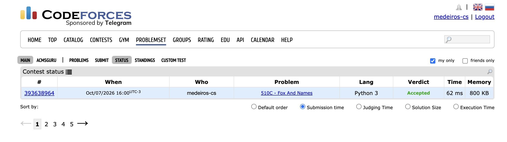

# Marco 4 — Implementação final e conclusão

**Problema:** *Fox And Names* (Codeforces 510C).

**Linguagem:** Python 3.

**Arquivo da solução:** [`src/main.py`](../src/main.py).

## 1. Solução final

A solução segue a estratégia do Marco 3, sem mudar o critério estrutural:

1. **Construção das restrições:** para cada par de nomes consecutivos `s` e `t`, procura-se a primeira posição em que diferem e cria-se a aresta `s[i] -> t[i]` no dígrafo de 26 vértices.
2. **Caso de prefixo:** se não há posição diferente e `|s| > |t|`, a resposta é `Impossible` antes de qualquer busca.
3. **Critério estrutural:** `Topological` executa `DirectedCycle`. Se há ciclo, a resposta é `Impossible`.
4. **Resposta:** se o grafo é um DAG, `Topological` executa `DepthFirstOrder` e a pós-ordem reversa é convertida de índices `0..25` para letras.

### Por que um único arquivo

O Codeforces aceita um único arquivo por submissão e não possui a biblioteca `algs4`. Por isso, as classes de referência foram copiadas para `src/main.py`, cada uma marcada com um comentário indicando o arquivo de origem. O arquivo do repositório é exatamente o arquivo submetido.

## 2. Classes reutilizadas e modificadas

Referência: `algs4-py/algs4`.

| Origem | Situação | Alterações | Justificativa |
|---|---|---|---|
| `utils/linklist.py` (`Node`, `LinkIterator`) | Reutilizada sem alterações | — | Dependência de `Bag` |
| `bag.py` (`Bag`) | Reutilizada com remoções | Removidos `__str__` e o bloco `__main__` | Não são usados pela solução |
| `digraph.py` (`Digraph`) | Reutilizada com remoções | Removidos a leitura por arquivo (`file=`), `__str__`, `degree`, `max_degree`, `number_of_self_loops`, `reverse` e o bloco `__main__` | O grafo é construído a partir dos nomes, não de um arquivo de arestas; os demais métodos não são usados |
| `directed_cycle.py` (`DirectedCycle`) | Reutilizada com remoções | Removido o bloco `__main__` | Lógica da DFS com `on_stack` mantida integralmente |
| `depth_first_order.py` (`DepthFirstOrder`) | Reutilizada com remoções | Removido o bloco `__main__` | Lógica da pós-ordem mantida integralmente |
| `topological.py` (`Topological`) | Reutilizada com remoções | Removidos o import de `SymbolDigraph` e o bloco `__main__` | Os vértices já são índices `0..25`; não há necessidade de tabela de símbolos |

**Nenhuma classe teve a lógica do algoritmo alterada.** Todas as modificações são remoções de código que não é usado no problema.

### Código específico do problema

| Função | Papel |
|---|---|
| `indice(c)` | Converte a letra em índice (`a` → 0, …, `z` → 25) |
| `construir_grafo(nomes)` | Compara nomes consecutivos, cria as arestas e detecta o caso de prefixo (retorna `None`) |
| `resolver(nomes)` | Decide entre `Impossible` e a ordem topológica, e converte índices em letras |
| `main()` | Lê a entrada e imprime a resposta |

Em `construir_grafo`, uma matriz `existe[26][26]` impede arestas repetidas, conforme previsto nos marcos 1 e 3. Essa verificação fica fora de `Digraph` para não alterar a classe de referência. Sem ela a resposta continuaria correta, pois arestas paralelas não criam ciclos nem mudam a ordem topológica; a matriz apenas mantém o grafo simples.

## 3. Diferenças em relação aos marcos anteriores

- **Linguagem:** o Marco 3 citava inicialmente `algs4-java`. A solução final usa `algs4-py`, que possui as mesmas classes (`Digraph`, `DirectedCycle`, `DepthFirstOrder`, `Topological`) com código bem menor. O Marco 3 foi atualizado para referenciar `algs4-py`.
- **`Stack`:** no `algs4-py`, `DepthFirstOrder` usa `collections.deque` para guardar a pós-ordem, e `reversePost()` a percorre ao contrário. Não há classe `Stack` separada.
- **DFS em vez de Kahn:** o Marco 1 mencionava a possibilidade de usar BFS/Kahn. A escolha final foi a DFS, pois `Topological` do `algs4` é baseada em DFS e reúne em uma única classe a detecção de ciclo e a ordenação.
- **Saída da instância do Marco 3:** o rastreamento do Marco 3 apresentou *uma* ordem válida (`bdacefgh…`). A implementação imprime a pós-ordem reversa real, `zyxwvutsrqponmlkjihgfedbac`. Ambas respeitam `b -> a`, `d -> a` e `a -> c`; o problema aceita qualquer permutação válida.
- **Ordem das adjacências:** `Bag` insere no início da lista, então `adj(v)` é percorrida na ordem inversa de inserção. Isso altera qual ordem válida é produzida, mas não a correção.

## 4. Testes

Os casos estão em [`dados/casos-de-teste.txt`](../dados/casos-de-teste.txt) e são executados por [`dados/testar.py`](../dados/testar.py):

```bash
cd T2
python3 dados/testar.py
```

Como a resposta não é única, o verificador não compara com uma saída fixa. Para casos válidos, ele confere que a saída é uma permutação das 26 letras e que os nomes ficam em ordem lexicográfica segundo ela. Para casos impossíveis, exige exatamente `Impossible`.

| # | Caso | Esperado | Saída obtida | Resultado |
|---|---|---|---|---|
| 1 | Exemplo 1 do enunciado | válido | `zyxwvutrsqponmlkjihgfedcba` | OK |
| 2 | Exemplo 2 do enunciado (ciclo) | `Impossible` | `Impossible` | OK |
| 3 | Exemplo 3 do enunciado | válido | `zyxwvutsrqpoljhgnefikdmbca` | OK |
| 4 | Exemplo 4 do enunciado (prefixos válidos) | válido | `zyxwvutsrqpnmlkjihfedcboga` | OK |
| 5 | Instância dos marcos 1 e 3 | válido | `zyxwvutsrqponmlkjihgfedbac` | OK |
| 6 | Um único nome | válido | `zyxwvutsrqponmlkjihgfedcba` | OK |
| 7 | Prefixo inválido (`abc`, `ab`) | `Impossible` | `Impossible` | OK |
| 8 | Prefixo válido (`ab`, `abc`) | válido | `zyxwvutsrqponmlkjihgfedcba` | OK |
| 9 | Ciclo de tamanho 2 | `Impossible` | `Impossible` | OK |
| 10 | Ciclo de tamanho 3 | `Impossible` | `Impossible` | OK |
| 11 | Arestas repetidas | válido | `zxywvutsrqponmlkjihgfedcab` | OK |
| 12 | Cadeia com as 26 letras | válido | `zyxwvutsrqponmlkjihgfedcba` | OK |
| 13 | Diferença após prefixo comum longo | válido | `zyxwvutsrqponmlkjihgfedcba` | OK |

**Resultado:** 13 de 13 casos corretos.

As saídas dos exemplos 1, 3 e 4 são diferentes das do enunciado, mas são válidas: o enunciado aceita qualquer permutação que ordene os nomes.

## 5. Complexidade

Mantém-se a análise do Marco 3:

- **Tempo:** `O(nL + V + E)`, com `n ≤ 100`, `L ≤ 100`, `V = 26` e `E ≤ n - 1` arestas distintas.
- **Memória do grafo:** `O(V + E)` nas listas de adjacência.
- **Memória auxiliar:** `O(V²)` para a matriz `existe` (676 posições, constante), `O(V)` para `marked`, `on_stack`, `edge_to`, pós-ordem e pilha de recursão, e `O(nL)` para os nomes lidos.

A recursão da DFS tem profundidade máxima 26, bem abaixo do limite padrão do Python.

## 6. Evidência do `Accepted`

- **Submissão:** _link da submissão no Codeforces_
- **Captura:** [`evidencias/accepted.png`](../evidencias/accepted.png)


